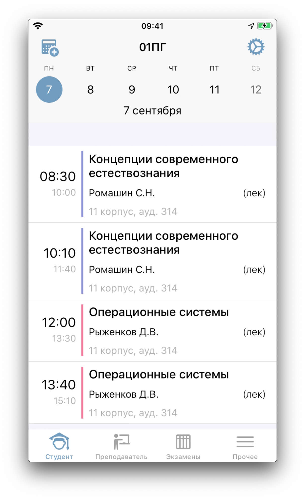

# Schedule
### Schedule app for Oryol State University

Allows to get access to classes schedule for students and teachers in a more convenient way.

- Convenient intuitive UI
- Caching for needed type of schedule
- Exams schedule
- Teacher info
- Map shows where the classes are taking place
- Export to calendar

This project uses [CocoaPods](https://cocoapods.org/) as a dependencies manager.
Minimal iOS version supported: _12.0_

### Used dependencies:

- [SwiftSoup](https://github.com/scinfu/SwiftSoup) for scraping teachers info (university web-site doesn't have an API for this)
- [SDStateTableView](https://github.com/sauvikdolui/SDStateTableView) for placeholders when there's no schedule
- [AFCurvedArrowView](https://github.com/anton-filimonov/AFCurvedArrowView) for a placeholder when no group ir teacher selected
- [ReachabilitySwift](https://github.com/ashleymills/Reachability.swift) for checking internet connection
- [PKHUD](https://github.com/pkluz/PKHUD) for displaying result of clearing cache
- [Alamofire](https://github.com/Alamofire/Alamofire) for networking
- [Kingfisher](https://github.com/onevcat/Kingfisher) for async image loading
- [SwiftyJSON](https://github.com/SwiftyJSON/SwiftyJSON) for loading json responsesas dictionaries
